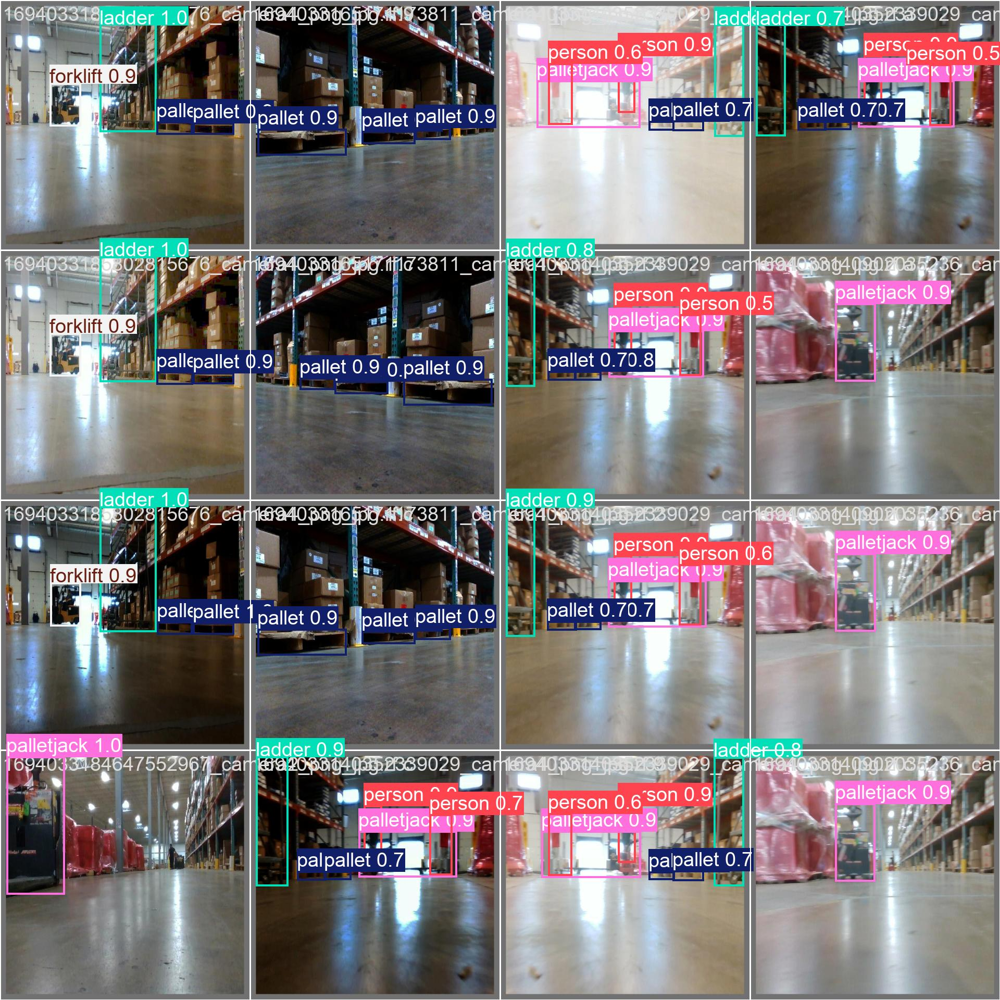

# Warehouse AGV Detection


> **Note**: Full code release is withheld until acceptance to protect intellectual priority during peer review, following standard academic practice.



Code repository for the paper submitted to *The Visual Computer*.

---

## 📌 Status
**Code will be released upon paper acceptance.**

This repository serves as a permanent link for the manuscript under review. The complete implementation, including source code, trained weights, and documentation, will be made publicly available following the formal acceptance of the paper.

## 📄 Paper Information
* **Title:** Lightweight Feature Fusion and Adaptive Upsampling for Real-Time Warehouse AGV Object Detection
* **Journal:** The Visual Computer
* **Dataset:** Warehouse-ijyxt (publicly available at [Roboflow](https://universe.roboflow.com/warehouse-ijyxt/warehouse-ijyxt) under CC BY 4.0 license)

## 📁 Planned Directory Structure
Upon acceptance, this repository will be populated with the following structure:

```text
warehouse-agv-detection/
├── datasets/          # Data preprocessing and augmentation scripts
├── models/            # Lightweight feature fusion and adaptive upsampling modules
├── weights/           # Pre-trained model weights (.pt files)
├── train.py           # Training script for AGV detection
├── val.py             # Evaluation and benchmark script
├── requirements.txt   # Environment dependencies
└── README.md
